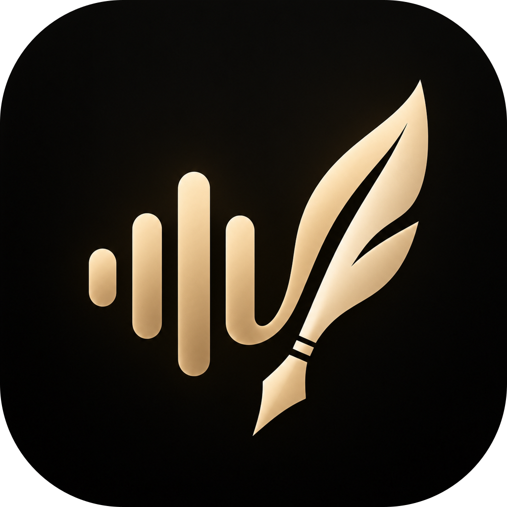

# Talkkeeper

<p align="center">
  
</p>

<p align="center"><b>Private recording, transcription and notes for conversations that must never leave your computer.</b></p>

> **Коротко по-русски.** Talkkeeper записывает разговор, расшифровывает его и
> помогает с заметками — целиком на вашем компьютере. С паролем записи и текст
> зашифрованы на диске, телеметрии нет, облако подключается только если вы сами
> этого захотите. Интерфейс по умолчанию русский; распознавание русской речи —
> GigaAM. Сборка для Windows 10/11.
>
> **Установка.** Установщик — на странице
> [Releases](https://github.com/leyvanah/Talkkeeper/releases). Он не подписан:
> Windows покажет «Система Windows защитила ваш компьютер» — «Подробнее» →
> «Выполнить в любом случае». Сверить файл можно командой
> `certutil -hashfile <файл> SHA256` с хешем из описания релиза. До первой
> настоящей записи задайте пароль: **Настройки → Защита**. Приложение само не
> проверяет обновления — новую версию ставьте поверх старой, данные и ключи
> сохраняются. При удалении программы папка с записями (по умолчанию
> `Музыка\meetily-recordings`) остаётся на диске. Подробнее — разделы
> [Install](#install) и [What goes over the network](#what-goes-over-the-network).

Talkkeeper is developed by [leyvanah](https://github.com/leyvanah). It started
life as a fork of an open-source meeting recorder and has since been reshaped
around one idea: **the recording of a conversation is the most private thing on
the machine, and the software should behave accordingly.**

## Philosophy

- **Local by default, local by design.** Recording, speech recognition,
  speaker separation and summaries all run on your own computer. A cloud model is
  something you connect deliberately, with your own key — never a fallback.
- **Encrypted at rest.** With a password set, every recording and every line of
  text in the database is sealed. A copied disk, a stray backup or a synced folder
  gives nobody the conversation.
- **No telemetry, no silent network.** There is no analytics code, the app never
  checks for updates by itself, and nothing is sent anywhere without you asking
  for it.
- **The person has the last word.** A transcript you corrected by hand stays
  corrected: recognising the recording again fills in around your edits instead
  of overwriting them.
- **Nothing is lost quietly.** Deleting app data warns you in plain words before
  it can make recordings unreadable, and the key can be exported whenever you
  want a copy.
- **Open source.** MIT licensed; read it, build it, change it.

## What it does

**Recording**
- Microphone and system audio are captured as separate tracks on a common clock,
  so two people talking at once are both kept.
- Echo handling for calls without headphones: Windows' own echo cancellation, and
  a detector that tells your voice apart from the other side's coming out of the
  speakers.
- Encoded while recording, so stopping is instant; a working 16 kHz track is kept
  for fast re-recognition.
- A floating mini bar, and optional detection of meeting apps.

**Transcription**
- Local engines: Whisper, **GigaAM** (strong on Russian) and Parakeet.
- Word-level timings: the word being heard is highlighted during playback.
- Speaker separation on the recorded tracks, with renaming.
- **Two views:** a chat-style transcript, and a table on a time ruler where the
  two sides of the conversation run in parallel columns and overlaps are visible
  at a glance.
- Correct or remove any line in place; re-recognition keeps your corrections.

**Notes and summaries**
- Summaries with local models (a bundled llama.cpp helper using Vulkan on the GPU,
  or the CPU), Ollama, or any OpenAI-compatible endpoint you choose.
- Custom templates, exports to PDF, DOCX, Markdown, text and JSON.

**Library and interface**
- A library organised by client, with recordings filed under each.
- Global search that works on the encrypted archive.
- Russian and English interface, light, dark and AMOLED themes.
- Resizable panels that collapse by dragging, a layout that is remembered, and a
  window frame drawn by the app itself.

## Install

Talkkeeper is built for **Windows 10/11 x64**. Installers are published on this
repository's [Releases](https://github.com/leyvanah/Talkkeeper/releases) page;
you can also build from source (below).

1. Download `Talkkeeper_<version>_x64-setup.exe` from the release.
2. Optional, but worth a minute: check that the file is the one that was
   published. In a command prompt, `certutil -hashfile Talkkeeper_<version>_x64-setup.exe SHA256`
   must print the SHA-256 given in the release notes.
3. Run it. The installer is **not code-signed**, so Windows SmartScreen shows
   *Windows protected your PC* and *Unknown publisher*: choose **More info →
   Run anyway**. It installs for the current user only, into
   `%LOCALAPPDATA%\Talkkeeper`, without administrator rights, and sets up
   Microsoft's Visual C++ runtime if needed.
4. On first start, pick a speech recognition model. It is downloaded once (see
   [What goes over the network](#what-goes-over-the-network)); after that,
   recording and recognition work without a connection.
5. Set a password in **Settings → Security** before the first real recording:
   until then recordings and text are stored unencrypted.

**Updating.** The app does not look for new versions. **Settings → About →
Releases on GitHub** opens the releases page in your browser. Run the new
installer over the old one: your meetings, recordings, models and keys are kept.

**Uninstalling.** Use *Settings → Apps → Installed apps → Talkkeeper* in Windows.

- By default only the program is removed; the data folder stays.
- The tick box *Also delete meetings, models, and local data* deletes the data
  folder as well. If a password is set, the uninstaller first asks separately,
  copies the key to `Documents\Talkkeeper-key-backup` and deletes nothing if
  that copy could not be written.
- **The recordings folder is never deleted by the uninstaller.** Delete it
  yourself if you no longer need it. Recordings made without a password are
  ordinary audio files that anyone with access to the disk can play.

## Your data

| Data | Where |
| --- | --- |
| Database, models, templates, keystore | `data\` in the installation folder (`%LOCALAPPDATA%\Talkkeeper\data`) |
| Recordings | `Music\meetily-recordings` by default; change it in **Settings → General** |
| Recording folders | named by an opaque identifier, so a folder listing says nothing about who or what |

## What goes over the network

**Settings → Security → This computer only** is on by default. While it is on,
summaries, the assistant and speech recognition talk only to programs on this
computer; a request to a cloud provider or another machine is refused before it
is made. Turning it off is a deliberate choice, and a cloud provider still needs
your own key.

The app itself connects only when you ask it to:

- **Downloading a model** you chose: speech recognition and summary models from
  Hugging Face; speaker models, and a fallback copy of one speech model, from
  the original project's GitHub releases. Every source is pinned to a fixed
  version, and every downloaded file is checked against its SHA-256.
- **A cloud summary or recognition provider**, if you turned off *This computer
  only* and chose one. The meeting text goes to that provider.

*Releases on GitHub* in **About** opens your browser; the app does not make
that request. See [`PRIVACY_POLICY.md`](PRIVACY_POLICY.md) for the full policy.

## Password and keys

**Settings → Security** puts a password in front of the archive.

- The password never becomes the key the data is encrypted with. It derives a
  key-encryption key through **argon2id** (19 MiB, 2 passes), which wraps a
  separate random data key. Changing the password rewraps 32 bytes; it does not
  rewrite the archive.
- A **recovery code** wraps the same data key in a second envelope. It is
  offered by default and shown exactly once. Without it, a forgotten password
  means nobody can open the archive, including you.
- **Locking wipes the key from memory** rather than covering the window. The
  archive locks when idle — never during a recording — and a recording cannot be
  started while it is locked.
- Guesses are throttled: three are free, then the wait doubles up to five
  minutes, and the count survives closing the app.
- The keys live in `keystore.json` in the app's data folder. It holds no secret
  in the clear; copying it gains an attacker only the right to guess.

**Keeping the key.** **Settings → Security → Save a copy of the key** writes the
keystore wherever you choose. Keep that copy *apart from the recordings*:
together they allow offline guessing of the password, which is exactly why the
app does not keep one beside them for you. When the uninstaller is asked to
delete the app data, it asks separately — naming what will become unreadable —
saves a copy of the key to `Documents\Talkkeeper-key-backup`, and refuses to wipe
anything if that copy could not be written.

### Quick unlock (Windows Hello, optional, off by default)

A Windows Hello prompt can be added as a faster way in. It needs the password to
switch on, and one switch removes it again.

It is a Hello prompt plus a key that **DPAPI** ties to this Windows account —
deliberately not a TPM-bound credential, which would require attaching the
machine to a Microsoft account or a domain. The difference matters:

- **The face check is enforced by the app, not by the encryption.** Code running
  under this Windows account can read the DPAPI blob without the prompt.
- A disk taken on its own is still useless, and so is the keystore on another
  machine or account. A key backup never includes this envelope.
- The password and recovery code are unaffected.

### Recordings on disk

Every track is sealed with **AES-256-GCM** under the archive's data key, in fixed
64 KiB frames, which keeps a recording seekable and lets one cut short by a crash
play up to where it stopped. Each frame is bound to its place in its own file, so
frames cannot be reordered or moved between recordings.

- Setting a password encrypts the recordings that already exist; removing it
  decrypts them first and deletes the key only once every one opens without it.
- No file is rewritten in place: a converted file is verified against the
  original's SHA-256 before it replaces it.
- **Settings → Security** counts what is encrypted and what is not, and offers to
  convert the rest.

### The database

Meeting titles, every line of transcript, word timings, speaker names, summaries,
and the names and notes of clients are sealed value by value with the same key,
with a fresh nonce for each write. The file stays an ordinary SQLite database, so
no patched SQLite is shipped.

- Setting or removing the password converts the database in one transaction; a
  copy is written beside it once, before the first conversion.
- Search runs in the application, because SQL cannot read a sealed column.
- The log files do not print titles, transcript text or names.

**What stays visible:** how many meetings there are, when each was recorded, how
long it ran, which client it is filed under, and how many lines it has. What was
said is not.

**Boundaries.** The key sits in the memory of the running app: cold-boot attacks,
swap files, crash dumps and an operating system you have already unlocked are
outside what this protects against. It defends the disk, not the machine while
you are using it.

## Build

<details>
<summary>Build instructions (Windows)</summary>

These are the steps of the [`Signed release`](.github/workflows/release-signed.yml)
workflow, written out for a clean Windows machine and a fresh clone.

**1. Tools**, installed once:

- Git.
- Visual Studio 2022 Build Tools with *Desktop development with C++* (MSVC,
  Windows SDK, C++ CMake tools for Windows).
- Rust, stable MSVC toolchain (`rustup default stable`).
- **LLVM 18.1.8**, exactly: `LLVM-18.1.8-win64.exe` from the
  [LLVM releases](https://github.com/llvm/llvm-project/releases/tag/llvmorg-18.1.8).
  The installer is not code-signed; check it before running it:
  `certutil -hashfile LLVM-18.1.8-win64.exe SHA256` must print
  `94af030060d88cc17e9f00ef1663ebdc1126b35e16bebdfa1e807984b70abd8f`.
  LLVM 19 and later break the generated whisper.cpp bindings. The build looks
  in `C:\Program Files\LLVM\bin`; if LLVM is elsewhere, set `LIBCLANG_PATH` to
  its `bin` folder.
- Node.js 22 and pnpm 11.25.0, the version pinned in
  `frontend/package.json`: `npm install --global pnpm@11.25.0`.

**2. Shell.** Run everything below in the *x64 Native Tools Command Prompt for
VS 2022*: it puts MSVC, CMake and Ninja on `PATH`, which the native parts of
the build need.

**3. The local model runner** (`llama-helper`), built once per clone and
whenever `llama-helper/` changes. The app takes it from
`frontend/src-tauri/binaries/` under two names; for development the same CPU
build serves as both (the release workflow builds the first one with Vulkan).
Build it from inside `llama-helper/`: only there cargo picks up
`llama-helper/.cargo/config.toml`, which links the C runtime statically, and
the build stops without it. `--target-dir` keeps the result where the copy
looks for it even when `CARGO_TARGET_DIR` is set (step 5):

```bat
pushd llama-helper && cargo build --release --target-dir ..\target && popd
if not exist frontend\src-tauri\binaries mkdir frontend\src-tauri\binaries
copy /y target\release\llama-helper.exe frontend\src-tauri\binaries\llama-helper-x86_64-pc-windows-msvc.exe
copy /y target\release\llama-helper.exe frontend\src-tauri\binaries\llama-helper-cpu-x86_64-pc-windows-msvc.exe
```

ffmpeg needs no step: the build downloads it and checks its SHA-256.

**4. The Visual C++ runtime installer.** The installer carries Microsoft's
`vc_redist.x64.exe` and runs it where the runtime is missing. The build expects
it in `frontend/src-tauri/runtime-deps/` and stops without it. Download it from
Microsoft and check the signature:

```bat
powershell -NoProfile -Command "$f='frontend\src-tauri\runtime-deps\vc_redist.x64.exe'; New-Item -ItemType Directory -Force (Split-Path $f) | Out-Null; Invoke-WebRequest https://aka.ms/vs/17/release/vc_redist.x64.exe -OutFile $f; Get-AuthenticodeSignature $f | Format-List Status,SignerCertificate"
```

`Status` must be `Valid` and the certificate subject must name
`O=Microsoft Corporation`.

**5. Build and run.** The first build compiles whisper.cpp, llama.cpp and the
ONNX Runtime bindings: 15–30 minutes and about 20 GB in `target\` (set
`CARGO_TARGET_DIR` to put it on another disk).

```bat
cd frontend
pnpm install --frozen-lockfile
pnpm tauri:dev:cpu
```

If the first window shows `ChunkLoadError`, press Ctrl+R in it: the dev server
was still compiling the page.

**6. Tests.**

```bat
cd frontend
pnpm test
cd src-tauri
cargo test
```

With 16 GB of memory, linking test binaries in parallel can run out of memory
(`os error 1455`, `LNK1318`); `cargo test -j 1` avoids it.

**Installer:** `pnpm tauri:build:cpu` in `frontend` builds the NSIS installer
into `target\release\bundle\nsis\`. A locally built installer contains the
build folder's absolute path; publish only installers from the workflow.

GPU builds: `pnpm tauri:dev:vulkan` needs the Vulkan SDK;
[`frontend/build-cuda-env.bat`](frontend/build-cuda-env.bat) sets up a CUDA
build from `CUDA_PATH`.

See [`ARCHITECTURE.md`](ARCHITECTURE.md) for implementation details.

</details>

## Code signing policy

Releases are **not code-signed** for now. Windows releases are built from this
repository by the [`Signed release`](.github/workflows/release-signed.yml)
workflow on GitHub-hosted machines, started by hand; a locally built installer
is never published. The SHA-256 of each installer is given in its release
notes. Signing through [SignPath Foundation](https://signpath.org/) is planned
once the app has more users; the workflow is ready for it.

Team roles:

- Committers and reviewers: [leyvanah](https://github.com/leyvanah)
- Approvers: [leyvanah](https://github.com/leyvanah)

Privacy: this program will not transfer any information to other networked
systems unless specifically requested by the user or the person installing or
operating it. Downloading a speech or language model, or sending a transcript to
a cloud model, happens only when you choose to do so.

## Credits and license

Talkkeeper is developed by [leyvanah](https://github.com/leyvanah).

It grew out of [Meetily - Actually Free](https://github.com/TylerBuza/Meetily-ActuallyFree)
by Tyler Buza, itself based on [Meetily](https://github.com/Zackriya-Solutions/meetily)
by Zackriya Solutions. Thanks to both projects.

MIT licensed — see [`LICENSE.md`](LICENSE.md). The original copyright notices are
retained.

### Third-party components

The installer also carries programs and models under their own licenses; the
installed app keeps their notices in `licenses\` in the program folder.

| Component | License |
|---|---|
| FFmpeg 8.0.1 (`ffmpeg.exe`, gyan.dev build) | GPL-3.0 — license, build description and source: [`licenses/ffmpeg/`](frontend/src-tauri/licenses/ffmpeg/SOURCE.md) |
| llama.cpp, whisper.cpp, ggml | MIT |
| ONNX Runtime | MIT |
| pyannote segmentation-3.0 | MIT |
| WeSpeaker ResNet34, VBx transform (speaker models) | CC BY 4.0 |
| Visual C++ Redistributable, DirectML; CUDA runtime and cuBLAS in the CUDA build | Microsoft / NVIDIA redistributable terms |

Details and attributions: [`THIRD-PARTY-NOTICES.md`](frontend/src-tauri/licenses/THIRD-PARTY-NOTICES.md).
